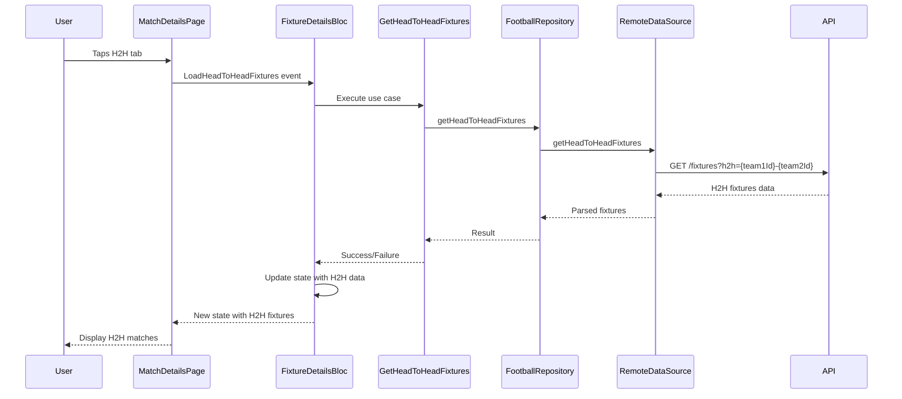

# H2H (Head-to-Head) Implementation Summary

## Overview

Successfully implemented proper H2H data fetching for the match details page following the API data guide patterns. The H2H tab now uses dedicated API calls instead of expecting H2H data from the main fixture API call.

## Key Changes Made

### 1. Data Source Layer

- **File**: `lib/data/datasources/remote/football_remote_data_source.dart`
- **Changes**:
  - Added `getHeadToHeadFixtures` method to interface
  - Implemented concrete method in `FootballRemoteDataSourceImpl`
  - Uses proper API endpoint: `/fixtures?h2h={team1Id}-{team2Id}`

### 2. Repository Layer

- **File**: `lib/domain/repositories/football_repository.dart`
- **Changes**: Added `getHeadToHeadFixtures` method to interface

- **File**: `lib/data/repositories/football_repository_impl.dart`
- **Changes**: Implemented H2H method with error handling and caching

### 3. Use Case Layer

- **File**: `lib/domain/usecases/football/get_head_to_head_fixtures.dart` (NEW)
- **Changes**: Created complete use case with `HeadToHeadParams` class

### 4. Bloc Layer

- **File**: `lib/presentation/blocs/football/fixture_details_event.dart`
- **Changes**: Added `LoadHeadToHeadFixtures` event

- **File**: `lib/presentation/blocs/football/fixture_details_state.dart`
- **Changes**:

  - Enhanced `FixtureDetailsLoaded` state with `headToHeadFixtures` field
  - Added convenience methods like `hasHeadToHeadFixtures`
  - Added `copyWith` method for state updates

- **File**: `lib/presentation/blocs/football/fixture_details_bloc.dart`
- **Changes**:
  - Added H2H use case dependency to constructor
  - Implemented `_onLoadHeadToHeadFixtures` event handler
  - Smart state management that preserves existing fixture data

### 5. Dependency Injection

- **File**: `lib/core/di/injection.dart`
- **Changes**:
  - Added `GetHeadToHeadFixtures` use case registration
  - Updated `FixtureDetailsBloc` factory to include H2H dependency

### 6. UI Layer

- **File**: `lib/presentation/pages/match_details/match_details_page.dart`
- **Changes**: Added H2H loading logic in `_handleTabChange` method (tab index 4)

- **File**: `lib/presentation/pages/match_details/widgets/h2h_tab.dart`
- **Changes**:
  - Updated to use `state.headToHeadFixtures` instead of `state.fixtures.sublist(1)`
  - Added proper H2H event triggering
  - Updated error handling and retry logic

## Implementation Flow

## Key Features

### Lazy Loading

- H2H data is only fetched when the H2H tab is accessed
- Improves app performance and reduces unnecessary API calls
- Respects API rate limiting

### State Management

- Clean separation between main fixture data and H2H data
- Preserves existing fixture data when adding H2H data
- Proper loading states and error handling

### Error Handling

- Comprehensive error handling at all layers
- User-friendly error messages in UI
- Retry mechanisms available

## Testing Requirements

### Manual Testing

1. **Basic H2H Loading**:

   - Open any match details page
   - Navigate to H2H tab
   - Verify H2H data loads correctly
   - Check loading indicators appear

2. **Error Handling**:

   - Test with poor network connection
   - Verify error messages display correctly
   - Test retry functionality

3. **State Preservation**:

   - Load match details (other tabs first)
   - Navigate to H2H tab
   - Verify original match data is still available
   - Navigate back to other tabs to confirm data persistence

4. **Performance**:
   - Measure initial page load time (should not be affected)
   - Verify H2H data only loads when tab is accessed
   - Check for memory leaks with repeated tab switching

### API Testing

1. **Valid H2H Requests**:

   - Test with teams that have played against each other
   - Verify correct API endpoint is called: `/fixtures?h2h={team1Id}-{team2Id}`
   - Check response parsing

2. **Edge Cases**:
   - Teams with no previous matches
   - API rate limiting scenarios
   - Network timeout handling

## Future Enhancements

1. **Caching**: Implement H2H data caching to avoid repeated API calls
2. **Pagination**: Add support for loading more H2H matches if needed
3. **Filtering**: Allow filtering H2H matches by competition/season
4. **Statistics**: Add detailed H2H statistics and trends

## Files Modified

- `/lib/data/datasources/remote/football_remote_data_source.dart`
- `/lib/data/repositories/football_repository_impl.dart`
- `/lib/domain/repositories/football_repository.dart`
- `/lib/domain/usecases/football/get_head_to_head_fixtures.dart` (NEW)
- `/lib/presentation/blocs/football/fixture_details_event.dart`
- `/lib/presentation/blocs/football/fixture_details_state.dart`
- `/lib/presentation/blocs/football/fixture_details_bloc.dart`
- `/lib/core/di/injection.dart`
- `/lib/presentation/pages/match_details/match_details_page.dart`
- `/lib/presentation/pages/match_details/widgets/h2h_tab.dart`

## Notes

- All changes follow the existing app architecture patterns
- Maintains consistency with other tab implementations
- Proper error handling and state management
- Rate limiting compliance
- Clean separation of concerns
